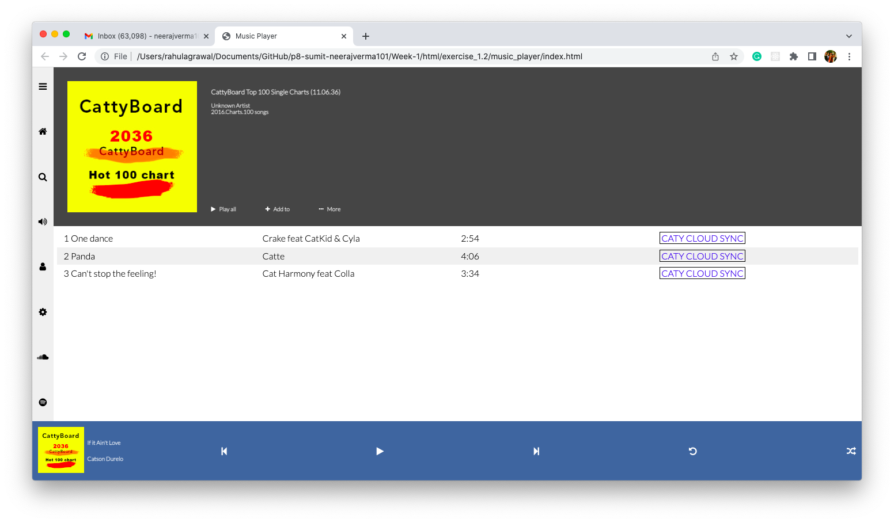

## **HTML Assignment** ##

### **Exercise1.1** ###

When a user enters an URL in the browser, how does the browser fetch the desiredresult? 

Explain this with the below in mind and Demonstrate this by drawing a diagram for the same.

a. What is the main functionality of the browser?

b. High Level Components of a browser.

c. Rendering engine and its use.

d. Parsers (HTML, CSS, etc)

e. Script Processors

f. Tree construction

g. Order of script processingh.Layout and Painting

### **Exercise1.2** ###

Use "Lato" font for entire text in UI. 

Use line awesome Icon library for all icons- Cattyboard album image URL:https://vif1g.csb.app/src/assets/cattyboard.jpg- Icons 

used in assignment:

la-bars

la-home

la-search

la-volume-up

la-user

la-cog

la-spotify

la-soundcloud

---

### **Run Application** ###

*Pre-requisite*:

Any recent Node version should be installed

Step 1: Navigate to "Week-1/html/exercise_1.2/musicplay"

Step 2: run command "npm start" to run development server if pacakges has been installed earlier else run "npm install" and then "npm start". 

### **Application Screenshot** ###

